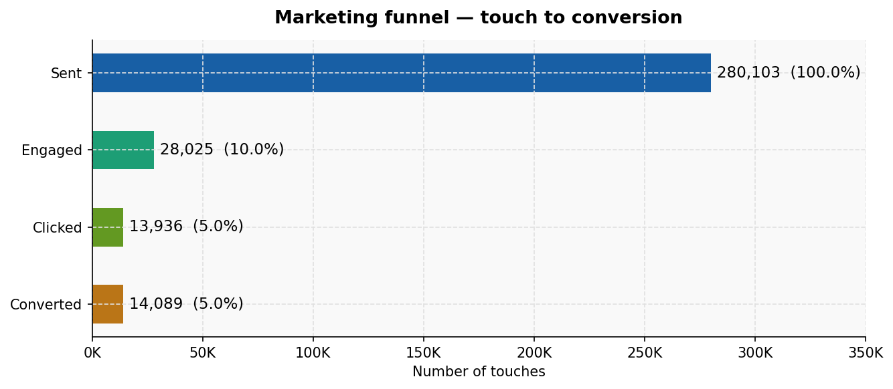
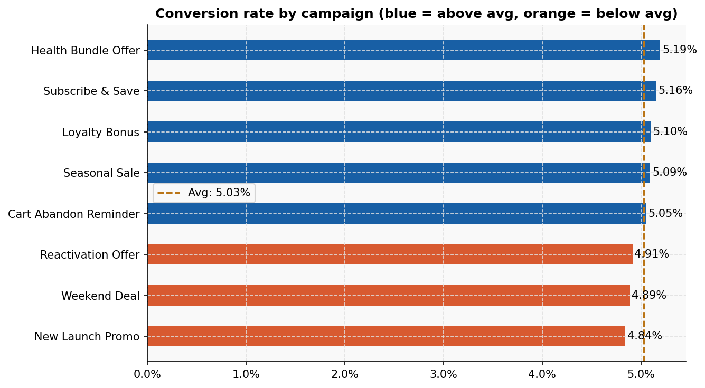
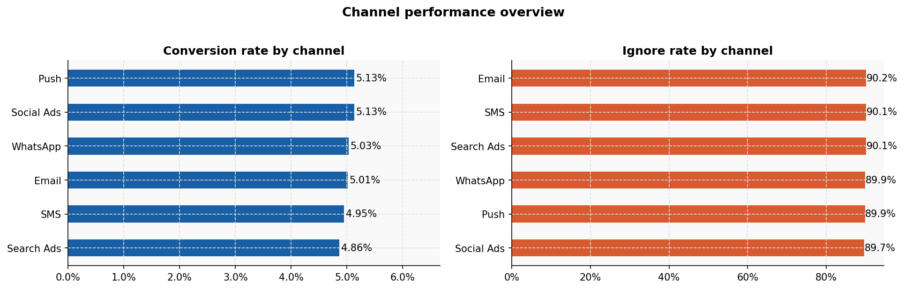
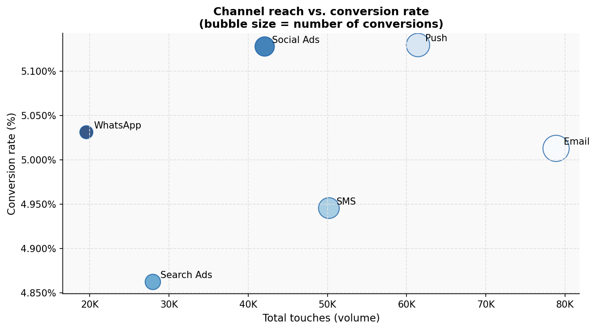
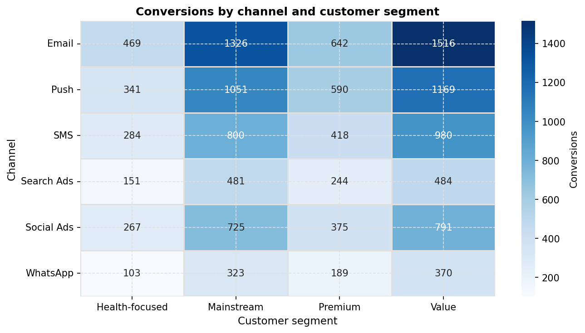
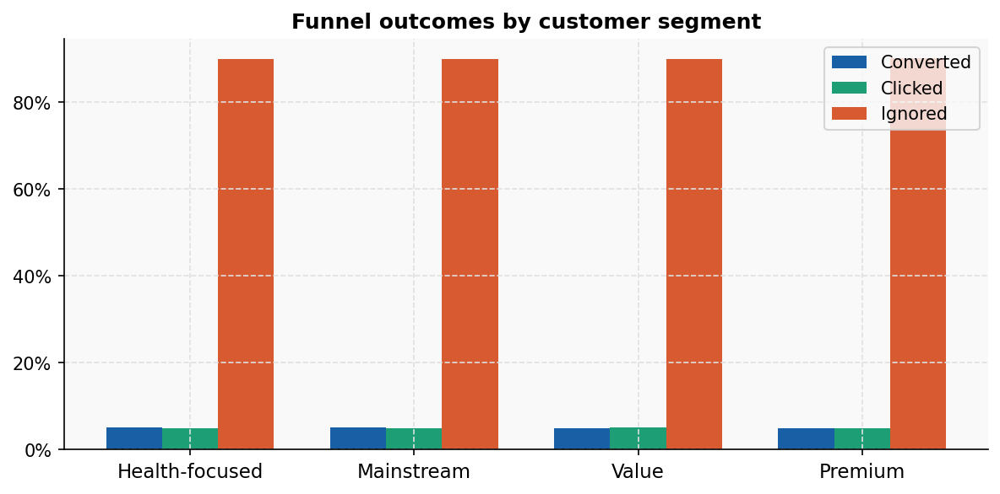
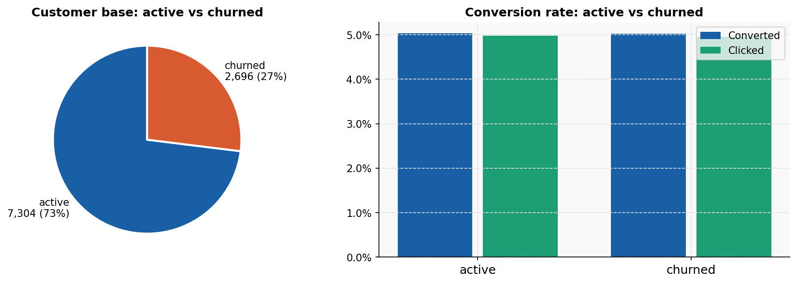
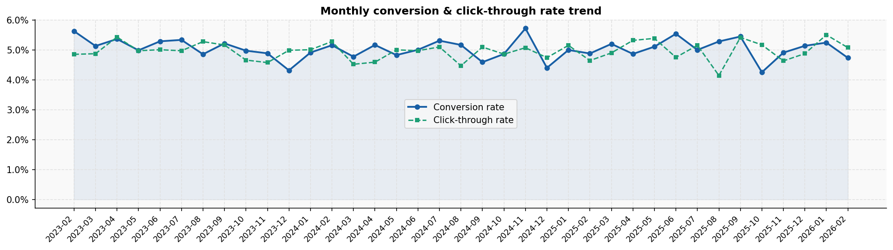
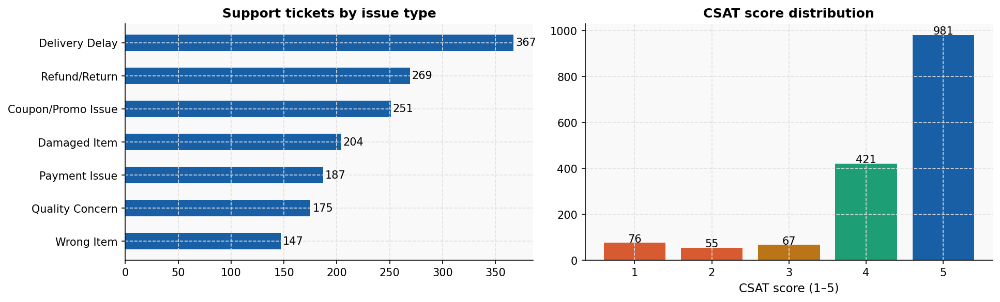
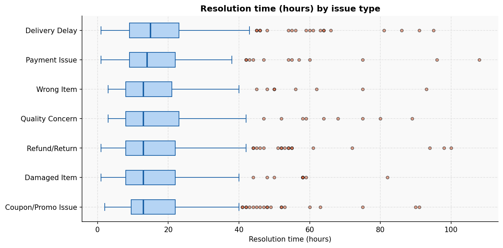

# Marketing & Customer Support Analytics Dashboard

**Author:** [Mojalefa Mokhathi](https://github.com/Mojalefa-04)

**Contact:** progressmokhathi@gmail.com | [LinkedIn](https://www.linkedin.com/in/mojalefa-mokhathi-81540224a)  

**Last Updated:** April 6, 2026  

---

## Table of Contents

1. [Overview](#overview)
2. [Dataset Description](#-dataset-description)
3. [Workflow Overview](#workflow-overview)
4. [Live Dashboard](#live-dashboard)
5. [Marketing Funnel Summary](#marketing-funnel-summary)
6. [Campaign Performance](#campaign-performance-analysis)
7. [Channel Performance](#channel-performance-overview)
8. [Customer Segmentation](#-customer-segmentation-analysis)
9. [Customer Status Analysis](#customer-status-analysis)
10. [Monthly Trends](#-monthly-trend-analysis)
11. [Support Analytics](#support-ticket-analysis)
12. [Strategic Recommendations](#strategic-recommendations)
13. [Tools and Technologies](#tools-and-technologies)

---

## Overview

This repository contains a comprehensive analytics dashboard tracking marketing campaign performance, channel effectiveness, customer segmentation, and support ticket analysis. The data covers the period from February 2023 to February 2026.

---
## 📊 Dataset Description

### Dataset Origin
**Dataset Name:** FMCG Customer Behavior & Marketing Analytics Data

**Publisher:** Shuchismita Mallick  

**License:** [CC BY 4.0](https://creativecommons.org/licenses/by/4.0/) (Attribution required)

### Key characteristics of the dataset:
  - 10,000+ customers
  - Hundreds of thousands of transactions
  - Multiple product categories
  - Multi-channel marketing data
  - Customer support interactions
  - Digital engagement sessions
  - External macroeconomic signals
    
**Data source**: [Kaggle](https://www.kaggle.com/datasets/shuchismitamallick/fmcg-customer-behavior-and-marketing-analytics-data)

### About the Dataset

> *"This dataset simulates a realistic end-to-end retail and marketing ecosystem for a large FMCG brand similar to companies like Nestlé or Unilever. It combines customer transactions, product purchases, marketing interactions, digital engagement, support tickets, and macroeconomic signals into a relational dataset designed for data science, analytics, and machine learning projects."*

### Why This Dataset?

This simulated dataset provides a **realistic, end-to-end retail and marketing ecosystem** that mirrors large FMCG brands. It was selected because it offers:

- **Comprehensive scope:** Marketing, transactions, support, and economic data in one relational structure
- **Realistic complexity:** Simulates real-world noise, seasonality, and customer behaviors
- **Privacy-safe:** No real customer PII, ideal for portfolio and educational projects
- **Production-like:** Mimics actual enterprise data warehouses in structure and scale

### Data Simulation Context

**Important Note:** This is a **simulated dataset** designed for educational and analytical practice. While it mirrors realistic FMCG industry patterns, it does not represent real customer data from any actual company.

| Attribute | Details |
|-----------|---------|
| **Industry Modeled** | Fast-Moving Consumer Goods (FMCG) |
| **Comparable Brands** | Nestlé, Unilever, P&G, PepsiCo |
| **Data Type** | Synthetic/Simulated |
| **Use Case** | Education, portfolio projects, methodology demonstration |
| **Real-world Application** | Analysis methods translate directly to actual FMCG datasets |

---

## Workflow Overview

This project analyzes marketing funnel performance using a structured data analysis pipeline:

1. **Data Loading**
   Import multiple datasets (campaigns, customers, channels, support data) and parse date fields.

2. **Data Exploration**
   Inspect data structure, check types, and ensure data quality.

3. **Funnel Metrics**
   Calculate key metrics such as engagement rate, click-through rate (CTR), and conversion rate.

4. **Funnel Visualization**
   Visualize user drop-off across funnel stages (Sent → Engaged → Clicked → Converted).

5. **Channel & Campaign Analysis**
   Evaluate performance across marketing channels and campaigns to identify top performers.

6. **Customer Insights**
   Merge datasets to analyze conversion behavior across customer segments.

7. **Reporting**
   Generate and save visualizations to communicate insights effectively.

---

## Live Dashboard

[Marketing Funnel & Conversion Permance Dashboard](https://public.tableau.com/app/profile/mojalefa.progress.mokhathi/viz/MarketingFunnelConversionPermanceDashboard/Dashboard1)

---
**Key Metrics at a Glance:**
- 280,103 total marketing touches
- 5.03% average conversion rate
- 73% active customer base
- 1,600 support tickets analyzed

---

## Marketing Funnel Summary

| Metric | Value | Percentage |
|--------|-------|------------|
| **Total Touches** | 280,103 | 100% |
| **Ignored** | 252,078 | 90.0% |
| **Engaged (Clicked)** | 13,936 | 5.0% |
| **Converted** | 14,089 | 5.0% |
| **Click-to-Convert Rate** | - | 50.3% |

&gt; **Key Insight:** Half of all engaged users (those who clicked) ultimately converted, indicating strong post-click conversion performance. However, the overall engagement rate remains low at 5%.

---

## Campaign Performance Analysis

&gt; **Key Insight:** Retention-focused campaigns outperform acquisition campaigns.

---

## Channel Performance Overview
### Conversion Rate by Channel

---

## Channel Reach vs. Conversion Analysis

&gt; **Key Insight:** Email delivers the highest absolute conversions due to volume, but Push and Social Ads offer better efficiency.

---

## 👥 Customer Segmentation Analysis

**Top Performing Segments:**
- **Value segment** drives the highest conversions across Email, Push, and SMS
- **Mainstream segment** consistently performs well across all channels

---

## Funnel Outcomes by Customer Segment

All segments show similar distribution patterns (~90% ignored, ~5% clicked, ~5% converted).

---

## Customer Status Analysis

| Status | Count | Percentage |
|--------|-------|------------|
| **Active** | 7,304 | 73% |
| **Churned** | 2,696 | 27% |

&gt; **Key Insight:** Active and churned customers show nearly identical conversion rates.

---

## 📅 Monthly Trend Analysis

**Data Period:** February 2023 - February 2026

- **Conversion Rate:** Fluctuates between ~4.2% and ~5.7%
- **Click-Through Rate:** Tracks slightly below conversion rate
- **Pattern:** Stable performance with seasonal Q4 peaks

---

## Support Ticket Analysis

**Average CSAT:** ~4.3/5

---

## ⏱️ Resolution Time Analysis

- **Typical Resolution Time:** ~15 hours (median)
- **Fastest Resolutions:** ~5 hours
- **Slowest Cases:** Up to 100+ hours

---

## Strategic Recommendations

### 1. Campaign Strategy
- **Double down** on retention campaigns (Health Bundle, Subscribe & Save)
- **Optimize** acquisition campaigns to match retention performance
- **Prioritize** Cart Abandon Reminder (high intent audience)

### 2. Channel Optimization
- **Increase Push notification** volume (highest conversion rate)
- **Improve Email engagement** (90.2% ignore rate needs attention)
- **Investigate Search Ads** underperformance (4.86% conversion)

### 3. Customer Segmentation
- **Focus on Value and Mainstream** segments for volume
- **Develop WhatsApp strategy** (lowest volume, potential growth)

### 4. Support Operations
- **Address Delivery Delay** root causes (#1 issue, 367 tickets)
- **Streamline Refund/Return** process (causing long-tail outliers)
- **Maintain CSAT excellence** (67% rate 4-5 stars)

### 5. Conversion Funnel
- **Priority:** Improve 5% engagement rate (90% ignore rate is critical)
- **Maintain** 50.3% click-to-convert rate
- **A/B test** subject lines and creative

---

## Tools and Technologies

| Library               | Purpose                                   |
| --------------------- | ----------------------------------------- |
| **pandas**            | Data manipulation and analysis            |
| **numpy**             | Numerical computing                       |
| **matplotlib**        | Primary visualization library             |
| **matplotlib.ticker** | Custom formatting (percentages, currency) |
| **seaborn**           | Statistical data visualization            |

### Visualization Tools

- Python (Matplotlib/Seaborn) - Static chart generation (all PNG files)
- Tableau - Interactive dashboard creation and exploratory analysis

### Data Processing

- Excel/CSV - Data storage and intermediate processing

---

